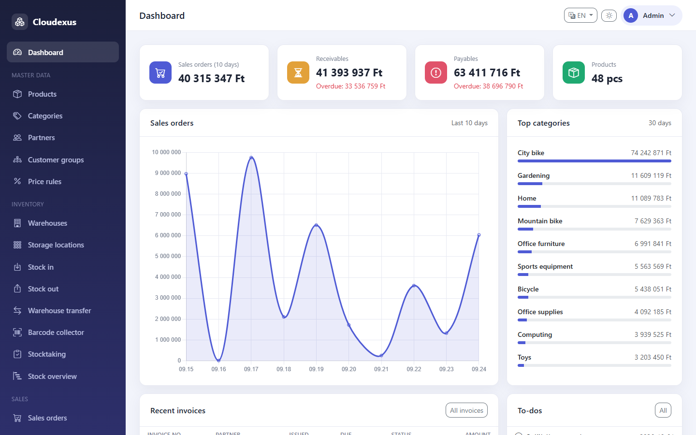
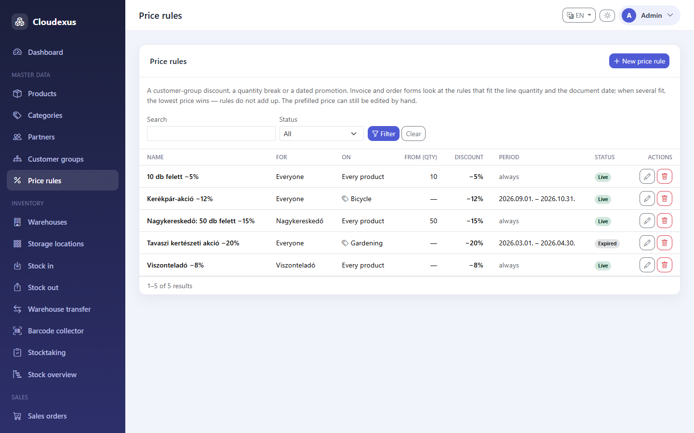
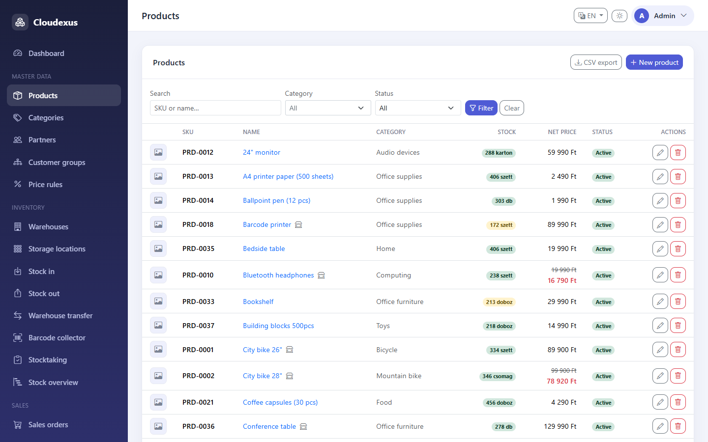
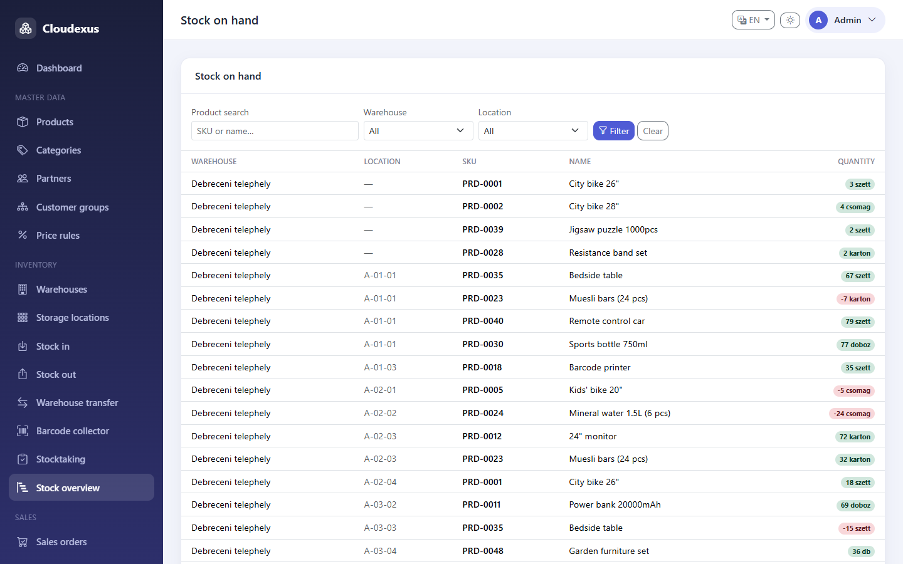
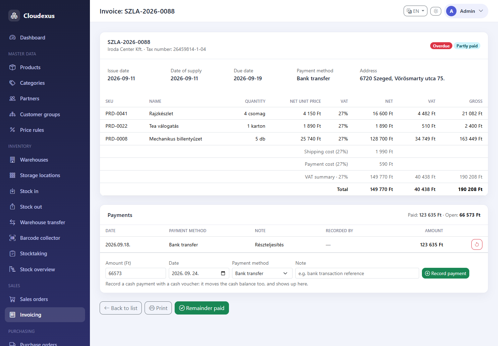
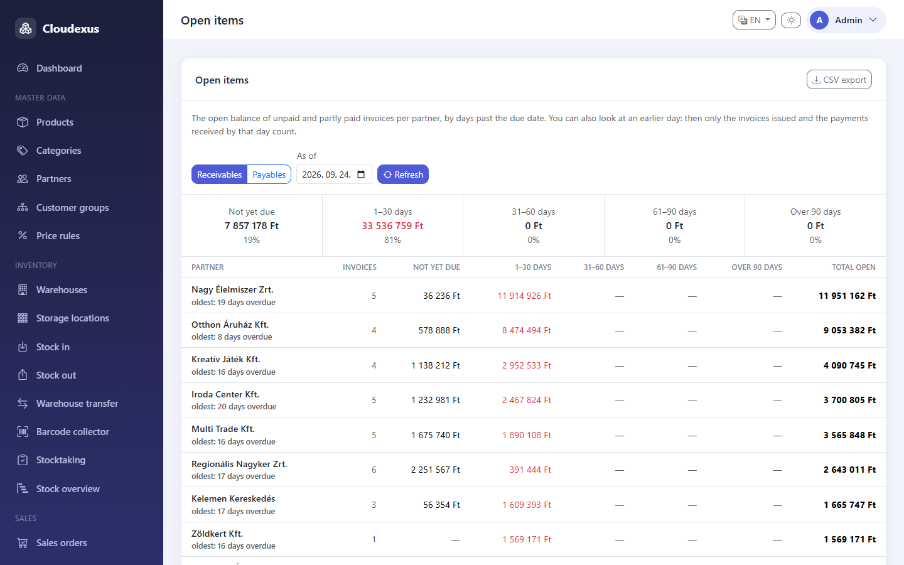
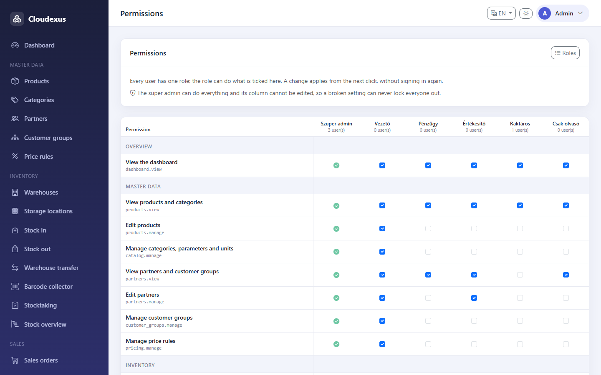
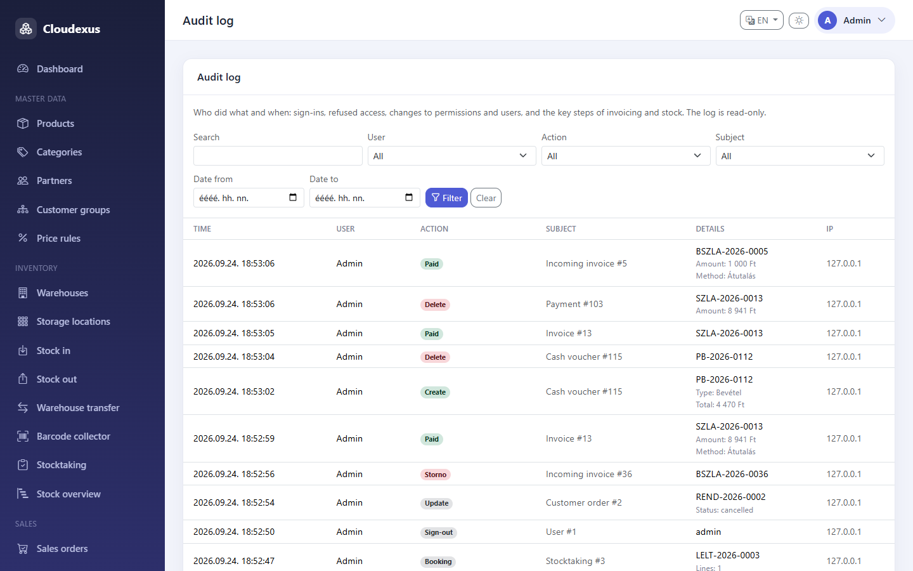
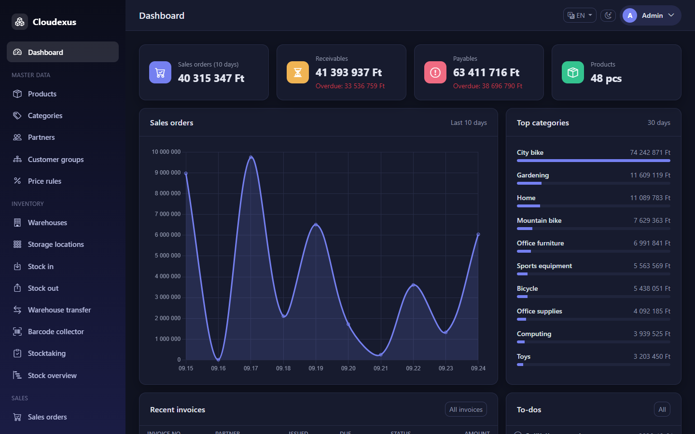
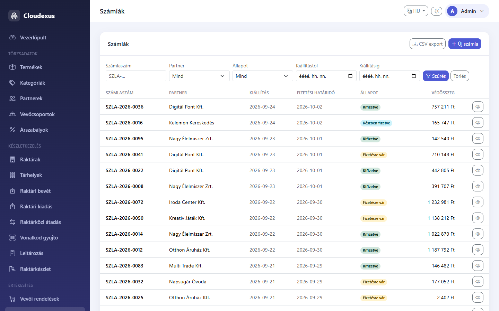

# Cloudexus

A business management system for trading companies that hold a lot of stock
and sell every day: the products and the partners, the warehouses and what is
in them, customer orders through to invoices and the money that comes in for
them, purchase orders through to supplier invoices and the money that goes out,
the cash desk, and the to-dos around the customers. One installation is one
company, with its own database and its own people.



Written in PHP 8.4 with Twig and MariaDB/MySQL. No framework: a router, a
handful of core classes, one controller per area and models that do all the
talking to the database, a stylesheet built by concatenating its own sources,
and every front-end library served from the application itself — it runs
without the internet, apart from the optional reCAPTCHA on sign-in.

## What it does

### Products and partners

- **A product catalog** with SKU, barcode, a category tree (a product can sit
  in several), a unit of measure, dimensions, parameters, pictures (uploaded or
  by URL), related and substitute products, a short and a long description in
  a rich-text editor, and its live stock.
- **Net price and VAT**, an optional sale price, and **customer groups**: a
  partner belongs to one, and the group can have its own price and sale price
  for any product.
- **Price rules** on top: a customer-group discount, a quantity break or a
  dated promotion, as a percentage off the list price or a fixed net price, for
  one product, one category and everything under it, or all of them. The order
  and invoice lines are priced for their quantity and the document's date, the
  rule that set the price is named under it, and when several fit, the lowest
  price wins — rules do not add up. Purchase forms take the plain price.
- **Partners** — customers, suppliers or both — with tax number, contacts,
  addresses and a history of calls, emails and meetings.
- Searchable, filterable, paged lists everywhere, sorted by clicking a column
  header (ascending, descending, then back to the list's own order), and
  search-as-you-type pickers for the long ones (products, categories, partners).





### Stock

- **Several warehouses**, each with its storage locations.
- **Stock in, stock out, and transfers** between warehouses (an out and an in,
  in one transaction), and a **barcode collector** for booking a whole delivery
  with a hand scanner.
- Stock is never stored: it is the sum of the movements, so it cannot drift.
  Every check and booking of a stock-out holds the warehouse's row lock, so two
  people — on the web or on the warehouse app — cannot both take the last piece.
- **Stocktaking**: count what is on the shelf, and the difference is booked as
  a correction. The book quantity is read at the moment of booking, not taken
  from a form opened an hour earlier.
- An overview of the stock by warehouse and product, and the products under
  their minimum on the dashboard.



### Sales

- **Customer orders** with line items priced as they are picked and a total that
  follows as they are typed; an order becomes an invoice in one click.
- **Invoices with VAT per line**, at each product's own rate, a VAT summary by
  rate, and shipping and payment costs with their VAT; amounts in forints are
  rounded to whole forints. Issuing an invoice can book the goods out of a
  warehouse — refused, before the invoice gets a number, if the stock is not
  there.
- The buyer's and the seller's name, tax number and address are **written onto
  the invoice when it is issued**, with the date of supply and the payment
  method, so a later change to a partner does not rewrite an old invoice.
- **Nothing issued is deleted or edited.** A wrong invoice is reversed with a
  storno invoice: the goods go back into the warehouse and the order can be
  invoiced again. An invoiced order cannot be cancelled or deleted.
- **Gapless numbering per year** for every document — invoice, order, purchase
  order, supplier invoice, cash voucher, stocktaking — taken from a locked
  counter when the document is saved, so two saves at the same moment cannot
  share a number and a refused one does not use one up.



### Purchasing

- **Purchase orders and supplier invoices**; a supplier invoice can book its
  goods into a warehouse as it is recorded. Cancelling one books them back out
  — and refuses if they have already been sold.

### Money

- **Partial payments**: an invoice, ours or a supplier's, takes any number of
  payments — bank transfer, card, cash on delivery, or a cash voucher — and is
  paid when they reach its total. A payment cannot be more than what is still
  open or dated in the future; a mistaken one can be reversed, and the invoice
  is open again. An invoice with payments on it cannot be reversed until they
  are.
- **The cash desk**: incoming and outgoing cash vouchers and the running cash
  balance. A voucher tied to an invoice is a payment on it; deleting the voucher
  takes the payment back.
- **Open items**, what customers owe us and what we owe suppliers, per partner,
  by days past due — not yet due, 1–30, 31–60, 61–90, over 90 — for today or
  any earlier day (counting only the invoices issued and the payments received
  by then), with a CSV export.



### People and access

- **Roles and a permission matrix**: six built-in roles — super admin, manager,
  finance, sales, warehouse, read-only — and any number of one's own, each
  allowed what is ticked for it: issuing or reversing invoices, marking them
  paid, moving stock, managing prices, and so on.
- Every request is checked on the server, the warehouse app's API included; the
  menu, the dashboard and the buttons only show what the role can use, and a
  change to the matrix applies from the next click, without signing in again.
- The super admin can do everything, from code rather than from the matrix, and
  the last active super admin cannot be demoted, deactivated or deleted — a
  broken setting cannot lock everybody out.
- **An audit log** of sign-ins and failed ones, two-step sign-in turned on and off, refused access, changes to users
  and to the matrix (what was added and what was taken away), invoices issued,
  reversed and paid, payments, cash vouchers, stocktakings, price rules and the
  company details — with who, when and from where, filtered by user, action,
  subject and date.





### The rest

- **Hungarian and English**, chosen per visitor. The catalog's own texts —
  product names and descriptions, categories, units, parameters — are stored
  per language too, and a missing translation falls back to the default
  language instead of showing nothing. Issued documents keep the name a product
  had when they were issued.
- **Currencies**: one primary currency that every amount is kept and shown in,
  and exchange rates for the others, fetched from the Hungarian National Bank's
  daily mid rates with a button or from cron.
- **A dark theme**, or the system's.
- **To-dos** with a due date, a person and a partner.





## The warehouse app

Stock in, stock out and transfers are booked from a phone or a handheld barcode
scanner with **[Cloudexus Mobile](https://github.com/szabolevi98/cloudexus-mobile)**,
an Android app the warehouse staff sign into with their own username. What they
book is credited to them and shows up in the web interface at once; the APK is
on the app's [releases](https://github.com/szabolevi98/cloudexus-mobile/releases)
page.

## Security, in short

- One CSRF gate for every form post, including sign-out; the session cookie is
  HttpOnly and SameSite.
- Passwords with bcrypt; ten failed sign-ins from one address lock it out for
  fifteen minutes, on the web and on the API alike; an optional score-based
  reCAPTCHA v3 on the sign-in form.
- **Two-step sign-in**, turned on by each user on their profile: a code from any
  authenticator app (TOTP) after the password, on the web and on the warehouse
  app's sign-in alike, with ten single-use recovery codes. A code works once,
  wrong codes count towards the lock-out, and turning it off or making new
  recovery codes asks for the password again. Whoever manages the users can turn
  it off for somebody who has lost their phone.
- Every page and every API call checks its permission on the server; the
  interface hiding a button is a convenience, never the gate.
- Nosniff, same-origin framing, a strict referrer policy, a Content-Security-Policy
  that forbids framing, plugins and foreign form targets, and HSTS when served
  over HTTPS.
- Money and stock are written in transactions with the rows they depend on
  locked: a payment cannot overpay an invoice, a stock-out cannot oversell.
- The document root is the `web/` folder alone; the code, the configuration
  and the runtime data live outside it.

## Running it

Needs PHP 8.4 (with `pdo_mysql`, `mbstring` and `curl`), MariaDB or MySQL,
Composer, and Apache with `mod_rewrite` whose document root is the `web/`
folder.

```
composer install
cp config/config.ini.dist config/config.ini       # then fill in the database and base_url
php database/migrate.php                           # creates the tables, and later brings them up to date
php database/create_admin.php admin a-long-password
```

Then open `base_url` and sign in. Every link is built from `app.base_url`, so it
has to be the address the application is opened at.

`database/migrate.php` runs every file under `database/core/` each time, so each
one is written to be run again (`IF NOT EXISTS`, `INSERT IGNORE`); it also loads
the starting permission matrix, once per role, and a permission added in a
later version is granted once to the roles it is meant for — one taken away in
the matrix is not given back.

In production (`debug = 0`) the compiled templates are cached under `var/cache`;
after an update, `php bin/clear_cache.php` empties it (`--logs`, `--sessions`
or `--all` for more). The built stylesheet is committed: after changing its
sources under `src/View/Css`, `php bin/build_css.php` builds it again.

The exchange rates, every weekday morning (the bank publishes them in the
morning):

```
10 7 * * 1-5 php /path/to/cloudexus/bin/sync_currency_rates.php --quiet
```

For development, PHP's own server stands in for Apache:

```
php -S 127.0.0.1:8080 -t web bin/dev-router.php   # with base_url = "http://127.0.0.1:8080"
```

### Something to look at

```
php database/seed_demo.php
```

Forty-eight products in Hungarian and English (some on sale, some with group
prices), seventeen partners in three customer groups, three warehouses with
storage locations, a few hundred stock movements, a hundred and thirty orders
and the hundred or so invoices made from them — most paid, some in part, some
overdue — purchase orders
and supplier invoices, cash vouchers, five price rules, to-dos, and three
currencies. It empties every business table first (the users stay), so it can
be run again at any time.

## The API

A JSON API for integrations — a webshop, say — and for the warehouse app, with
bearer tokens: integration tokens are made under **API → API users**; the staff
sign in with their own username and password (`POST /api/auth/login`) and get a
token that acts as them, with their role's permissions.

- **Read**: the whole catalog (products, categories, units, parameters), stock,
  invoices, currencies, languages, and the price of a product for a partner, a
  quantity and a date.
- **Write**: partners and orders, in full.
- **Stock**: a product by its barcode, and stock in, out and transfers with any
  number of lines, credited to the person signed in; an `Idempotency-Key`
  header makes a request resent over bad Wi-Fi book once.
- Amounts are in the primary currency (`meta.currency`); the catalog's texts
  come in the language asked for with `?language=` (`meta.language`). Every
  answer and every error is JSON, in English.

The endpoints, with their requests, answers and curl examples, are in
[web/API.md](web/API.md), and inside the application under **API → API
documentation**.

## Checking it

```
vendor/bin/phpunit                                   # unit tests, and integration tests against a *_test database
php tests/smoke.php --url=http://127.0.0.1:8080 --user=admin --password=…
```

The unit tests need nothing but PHP: the permission catalog and the default
matrix, every Hungarian sentence having its English one, labels for every
permission and audit action. The integration tests need a database of their
own, named in `config/test.ini`, whose name must end in `_test` — they empty it
before every test: document numbering, VAT per line, stock-outs and shortages,
storno, partial payments and cash vouchers, the open-items buckets, price rule
resolution, the permission matrix, stock locks and stocktaking.

The smoke test walks a running installation over real HTTP: it signs in
through the form, opens every page, downloads a CSV, checks that the API wants
a token, and signs out. CI runs all of it on every push, against a real MariaDB
and a freshly migrated, seeded installation.

## Layout

```
bin/            stylesheet build, cache clearing, the exchange-rate job, the dev router
config/         config.ini.dist — the real config.ini is never committed
database/       the migrations as .sql files, the runner, the first admin, the demo seed
docs/           the pictures in this README
src/Core/       config, router, session, CSRF, auth, access, audit log, currencies, languages, …
src/Controller/ one class per area, and the API under Controller/Api
src/Language/   hu/ and en/, one file per area
src/Model/      everything that touches the database, by area
src/View/       Twig templates, and the CSS sources
tests/          unit and integration tests, and the smoke test over HTTP
web/            the document root: the front controller and the assets
```

## License

[GNU AGPLv3](LICENSE) — © 2026 [szabolevi98](https://github.com/szabolevi98/Cloudexus)
